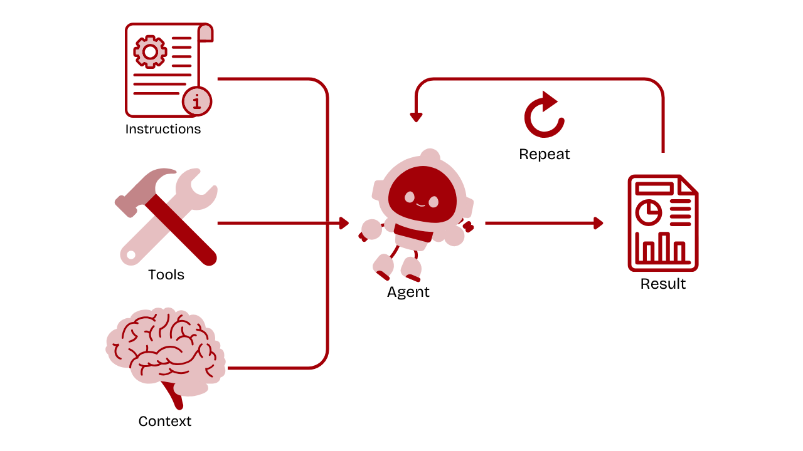
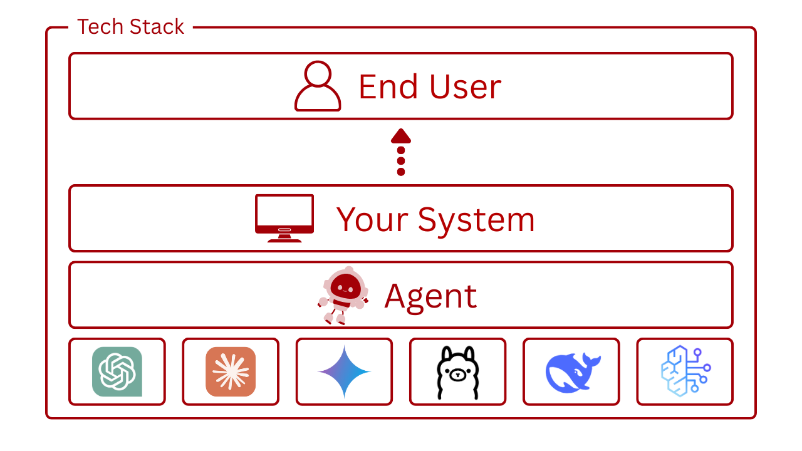

# Introduction to Agents

## What is an AI Agent?

An AI agent is a software system that can perceive its environment, make decisions, and take actions to achieve specific goals. Unlike standard AI models that simply respond to inputs with outputs, agents actively interact with their environment in a goal-directed manner. 

Agents are built on top of large language models (LLMs). This creates a system with the knowledge and power of the base LLM, but also the ability to interact with the outside world. An AI agent can do this with the special abilites (tools) it is given. Tools allow agents to query APIs, search the internet, process images and other media, and so much more.

## Core Components of AI Agents

You can think of an AI agent as a guided LLM with instructions, tools, and contect. LLMs like Claude and Chat-GPT act in an input / output mode where each user input leads to an LLM output. Agents seem to perform the in the same way when looking at the surface: a user sends an input (prompt) and the agent produces an output. However, under the covers there is an agent loop that is happening.



The agent uses its instructions, tools, and context to decide when it has enough information to fulfill its prompt. It may make a tool call, analyze the result, and decide to make another tool call. This continues until the final goal is achieved.

### Instructions
When creating an agent you supply it with instructions that outline its general purpose and goal. Instructions can be general, allowing the agent more agency (*for lack of a better word*). They can also be highly specific, guiding the agent in using its tools in a step by step process. Look at these examples from two of our example agents:

#### [Basic Agent](https://github.com/supercog-ai/agentic/blob/main/examples/basic_agent.py)
```
You are a helpful assistant that reports the weather.
```

#### [AI News Reporter](https://github.com/supercog-ai/agentic/blob/main/examples/podcast.prompts.py)
```
You are an experienced, hard-hitting news reporter. You are preparing a news report.
Follow these steps precisely:
    1. Search for headlines, using query_news, about "AI and artificial intelligence" but exclude "motley fool".
    2. Download pages for the most interesting articles, max 10.
    3. Now create a long, extensive "morning news" report in the style of NPR or CNN, but with a hard news edge, and reporting as "Supercog News", at least 10,000 characters. Do not print any paragraph headers.
    4. Now convert the show into speech, choosing one of the available voices at random.
```

### Tools
These are sets of functions that the agent may decide to use. For example, I could supply my agent with two tools: a weather tool and a news tool. When I ask the agent to "*Report the weather in New York City*" it knows to call the weather tool and not the news tool.

### Context
A lot of the power of agents come from their context. They are able to leverage several types of context to look at the current computation holistically.

- **Large Language Models (LLMs)**: LLMs have their own knowledge indexes that the agent can draw on.
- **Short Term Memory**: Short term memory is used to track things like previous prompts, tool results, error resolutions, etc.
- **Long Term Memory**: Long term memory can be added to the agent and persists across threads. Memories are set by the creator of the agent and can include things like remembering a certain piece of information, or how to correctly call a function.
- **Reasoning**: The agent takes all of these sources into account at each step, attempting to make the best decision to proceed toward its goal.

## Agents vs. LLMs



Large Language Models are typically a central component of modern AI agents, but the two are not synonymous:

- **LLMs as Foundation**: LLMs provide the language understanding, generation, and reasoning capabilities.
- **Beyond LLMs**: Agents extend LLMs with action capabilities, persistent memory, and goal-oriented behavior.
- **Architectural Relationship**: Generally, the LLM acts as the "reasoning engine" while agentic components handle tools, memory, and  execution.

*TLDR; Agents are built on top of LLMs.*

## Common Use Cases

| Domain | Use Cases |
|--------|-----------|
| **Personal Assistants** | <ul><li>Meeting scheduling</li><li>Email management</li><li>Task automation</li> |
| **Customer Service** | <ul><li>Automated support agents</li><li>Issue troubleshooting</li><li>Complaint resolution</li> |
| **Research & Analysis** | <ul><li>Data exploration</li><li>Literature review</li><li>Trend identification</li> |
| **Code & Software Development** | <ul><li>Code generation and debugging</li><li>Testing automation</li><li>Documentation creation</li> |
| **Business Process Automation** | <ul><li>Document processing</li><li>Data entry and validation</li><li>Report generation</li> |

## Key Challenges

1. **Hallucination Management**: Ensuring agents don't fabricate information or capabilities.
2. **Tool Integration**: Creating reliable, secure interfaces between the agent and external systems.
3. **Goal Alignment**: Making sure agent actions match user intentions and expectations.
4. **Context Limitations**: Managing finite context windows and memory constraints.

## Evaluation Metrics

- **Task Completion Rate**: Percentage of tasks successfully accomplished
- **Efficiency**: Steps or time required to complete tasks
- **Autonomy**: Level of human intervention required
- **Adaptability**: Performance across varied environments or tasks

AI agents represent a significant evolution beyond traditional AI systems, combining the capabilities of foundation models with the ability to take actions, maintain memory, and pursue goals over extended interactions.
