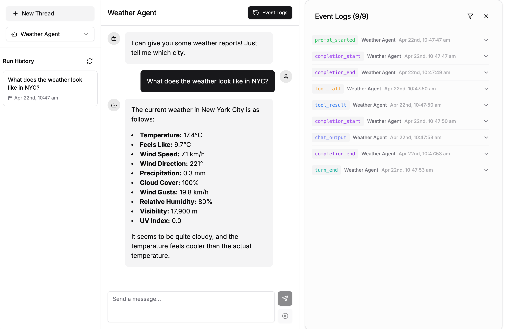

# Getting Started

This guide will walk you through installing Agentic, setting up your first agent, and understanding how it works.

<div style="position: relative; padding-bottom: 56.25%;"><iframe width="100%" height="100%" style="position: absolute;" src="https://www.youtube.com/embed/18SSYePPKVw?si=C-k9YVVsFVh8VDE4" title="Getting Started With Agentic" frameborder="0" allow="accelerometer; autoplay; clipboard-write; encrypted-media; gyroscope; picture-in-picture; web-share" referrerpolicy="strict-origin-when-cross-origin" allowfullscreen></iframe></div>

## Prerequisites

> **Note**: Agentic requires Python 3.12. It does not work with Python 3.13+ due to [Ray compatibility issues](https://github.com/ray-project/ray/issues/50226).

Before you begin, ensure you have the following:

- Python 3.12
- `uv` - a Python package manager ([installation instructions](https://docs.astral.sh/uv/getting-started/installation/))
- `node` & `npm` _Optional_ - used for building the frontend dashboard ([installation instructions](https://docs.npmjs.com/downloading-and-installing-node-js-and-npm))
- `git` _Optional_ - used for cloning from source ([installation instructions](https://git-scm.com/downloads))

## Installation & Setup

### 1. Set up a project directory

Set up a directory to hold your agentic project, and create a virtual environment using `uv`:

```bash
mkdir -p ~/agentic
cd ~/agentic
uv venv --python 3.12
source .venv/bin/activate
```

### 2. Install Agentic

To install Agentic you can either install from source or from PyPI.

> **Note**: In this guide we'll install the `all` extra which includes all tools and features. To customize your installation, see the [pyproject.toml](https://github.com/supercog-ai/agentic/blob/main/pyproject.toml) for a list of all available extras.

> If you're on Linux or Windows you will need to add `--extra-index-url https://download.pytorch.org/whl/cpu` to install the CPU version of PyTorch.

<table>
<tr>
<th> Source </th>
<th> PyPI </th>
</tr>
<tr>
<td>

```bash
git clone git@github.com:supercog-ai/agentic.git

# For MacOS
uv pip install -e "./agentic[all]"

# For Linux or Windows
uv pip install -e "./agentic[all]" \
--extra-index-url https://download.pytorch.org/whl/cpu
```

</td>
<td>

```bash
# For MacOS
uv pip install "agentic-framework[all]"

# For Linux or Windows
uv pip install "agentic-framework[all]" \
--extra-index-url https://download.pytorch.org/whl/cpu
```

</td>
</tr>
</table>

### 3. Initialize Agentic

Initialize Agentic in your project directory:

```bash
agentic init .
```

The initialization will copy examples and a basic file structure into the directory `agents`.

```
.
├── agents                  # Your agents
├── examples                # Example agents made by us
│   ├── __init__.py
│   ├── agentic_oracle.py
│   ├── ...                 # Other examples
│   └── tool_builder.py
├── runtime                 # Runtime data (cli history, run logs, etc)
├── tests                   # Space to put your tests
└── tools                   # Space to put custom tools
```

### 4. Configure Secrets

Agentic stores settings and secrets in a sqlite database on your machine. The file is located at `~/.agentic/agentsdb`. 

To run agents you'll need at least one llm api key configured. Go to our [models page](./core-concepts/models.md) for a list of supported models. You can set api keys using the `agentic secrets` command:

```bash
agentic secrets set OPENAI_API_KEY=...
```

> **Note**: You can also optionally create a `.env` file in the root of your project directory to store your secrets.

## Creating Your First Agent

Let's build our first agent - a simple weather reporting agent.

Create a new file `./agents/weather.py`, and add this code:

```python
from agentic.common import Agent, AgentRunner
from agentic.tools import WeatherTool

weather_agent = Agent(
    name="Weather Agent",
    welcome="I can give you some weather reports! Just tell me which city.",
    instructions="You are a helpful assistant.",
    tools=[WeatherTool()],
    model="openai/gpt-4o-mini"
)

if __name__ == "__main__":
    AgentRunner(weather_agent).repl_loop()
```

## Running Your Agent

### Using the CLI

```bash
python agents/weather.py
```

You should see output like:

```
I can give you some weather reports! Just tell me which city.
press <ctrl-d> to quit
[Weather Agent]> What does the weather look like in NYC?
The current weather in New York City is as follows:

- **Temperature:** 17.4°C
- **Feels Like:** 9.7°C
- **Wind Speed:** 7.1 km/h
- **Wind Direction:** 221°
- **Precipitation:**  0.3 mm
- **Cloud Cover:** 100%
- **Wind Gusts:** 19.8 km/h
- **Relative Humidity:** 80%
- **Visibility:** 17,900 m
- **UV Index:** 0.0

It seems to be quite cloudy, and the temperature feels cooler than the actual temperature.
[openai/gpt-4o-mini: 2 calls, tokens: 162 -> 144, 0.02 cents, time: 3.81s tc: 0.02 c, ctx: 306]
[Weather Agent]> 
```

### Using the Next.js Dashboard

Running your agents in the dashboard is a great way to visualize your agents and their interactions:

```bash
agentic dashboard start --agent-path ./agents/weather.py
```



Congratulations! You've created an agent powered by the GPT-4o-mini LLM, and given it a tool which it can use to retrieve weather reports (provided by [Open-meteo](https://open-meteo.com)).

## Next Steps

- Learn more about [Agent Concepts](./core-concepts/index.md)
- Learn how to create your own [Tools](./tools/index.md)
- Explore the [Database Agent](https://github.com/supercog-ai/agentic/blob/main/examples/database/database_agent.py){target="_blank"} for a basic Text-to-SQL agent
- Discover how to build [Agent Teams](./building-agents/agent-teams.md)
